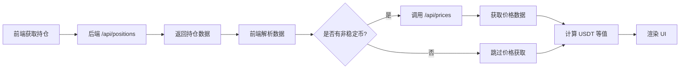

# 持仓监控页面改进（方案4）

## 📋 改进概述

本次改进实现了持仓监控页面的多维度数据展示，包括：
1. ✅ 稳定币识别和分类统计
2. ✅ 实时价格获取和 USDT 等值计算
3. ✅ Gate.io 合约账户余额显示
4. ✅ 优化的 UI 展示（4个汇总卡片 + 非稳定币明细）

---

## 🔧 后端改进

### 1. 新增 `/api/prices` 接口

**位置**: `backend/main.py` (第 706-788 行)

**功能**: 批量获取多个币种的价格（用于计算持仓价值）

**请求示例**:
```json
{
  "symbols": [
    {"exchange": "binance", "symbol": "BTC/USDT"},
    {"exchange": "okx", "symbol": "ETH/USDT"}
  ]
}
```

**返回示例**:
```json
{
  "success": true,
  "data": {
    "binance": {"BTC/USDT": 50000.0},
    "okx": {"ETH/USDT": 3000.0}
  },
  "timestamp": 1234567890000
}
```

**特点**:
- 按交易所分组批量获取，提高效率
- 自动加载市场数据缓存
- 错误处理：单个交易对失败不影响其他
- 使用最新成交价 (`ticker.last`)

---

### 2. 修复 Gate.io 合约账户余额获取

**位置**: `backend/main.py` (第 863-920 行)

**问题**: 之前只获取合约持仓（`fetch_positions()`），不获取合约账户余额

**解决方案**: 
- 在获取 Gate.io 合约持仓后，额外调用 `fetch_balance()` 获取合约账户余额
- 新增 `futures_balance` 类型，用于标记合约账户中未开仓的资金

**代码逻辑**:
```python
# Gate.io 合约配置
futures_config = exchange_config.copy()
futures_config['options'] = {'defaultType': 'swap'}
futures_exchange = exchange_class(futures_config)

# 1. 获取合约持仓
positions = futures_exchange.fetch_positions()

# 2. 获取合约账户余额（新增）
futures_balance = futures_exchange.fetch_balance()
futures_total = futures_balance.get('total', {})

# 添加合约账户余额到持仓列表
for currency, amount in futures_total.items():
    if amount and float(amount) > 0:
        all_positions.append({
            'exchange': exchange_id,
            'symbol': currency,
            'type': 'futures_balance',  # 合约账户余额
            'amount': float(amount),
            'free': float(futures_balance.get('free', {}).get(currency, 0)),
            'used': float(futures_balance.get('used', {}).get(currency, 0)),
        })
```

**返回数据类型**:
- `spot`: 现货持仓
- `futures`: 合约持仓（有开仓）
- `futures_balance`: 合约账户余额（未开仓的资金）✨ **新增**

---

## 🎨 前端改进

### 1. 稳定币识别功能

**位置**: `src/components/PositionMonitor.jsx` (第 202-206 行)

**功能**: 识别常见稳定币，价格固定为 1 USDT

```javascript
const isStableCoin = (symbol) => {
  const stableCoins = ['USDT', 'USDC', 'BUSD', 'DAI', 'TUSD', 'USDP', 'GUSD', 'USDD'];
  return stableCoins.includes(symbol.toUpperCase());
};
```

**优化**:
- 稳定币不调用价格 API（减少请求）
- 价格直接返回 1（提高计算速度）

---

### 2. 价格获取优化

**位置**: `src/components/PositionMonitor.jsx` (第 208-259 行)

**改进**:
1. 跳过稳定币的价格请求
2. 使用 `exchangeId`（小写原始ID）调用后端 API
3. 增强错误日志（区分 API 失败和返回失败）

**代码示例**:
```javascript
positionsList.forEach(pos => {
  const baseCurrency = pos.symbol;
  // 跳过稳定币（价格固定为1）
  if (isStableCoin(baseCurrency)) {
    return;
  }
  
  // 为每个币种获取对 USDT 的价格
  const symbol = `${baseCurrency}/USDT`;
  symbolsToFetch.push({
    exchange: pos.exchangeId, // 使用原始小写ID
    symbol: symbol
  });
});
```

---

### 3. 持仓数据处理

**位置**: `src/components/PositionMonitor.jsx` (第 123-146 行)

**改进**:
1. 保存 `exchangeId`（原始小写ID）用于 API 调用
2. 保存 `exchange`（格式化名称）用于显示
3. 支持 `futures_balance` 类型（合约账户余额）

```javascript
if (!positionMap.has(key)) {
  positionMap.set(key, {
    key: key,
    exchangeId: pos.exchange.toLowerCase(), // 保存原始小写ID用于API调用
    exchange: formatExchangeName(pos.exchange), // 格式化名称用于显示
    symbol: pos.symbol,
    spotAmount: 0,
    futuresAmount: 0,
    totalAmount: 0,
  });
}

const position = positionMap.get(key);

if (pos.type === 'spot') {
  position.spotAmount += pos.amount;
} else if (pos.type === 'futures' || pos.type === 'futures_balance') {
  // futures: 合约持仓（有开仓）
  // futures_balance: 合约账户余额（未开仓的资金）
  position.futuresAmount += pos.amount;
}
```

---

### 4. 汇总统计优化

**位置**: `src/components/PositionMonitor.jsx` (第 352-422 行)

**改进**: 使用 `exchangeId` 进行价格计算

```javascript
// 按交易所汇总数据（带USDT等值）
const exchangeSummary = useMemo(() => {
  return positions.reduce((acc, item) => {
    // 计算USDT等值（使用 exchangeId）
    const spotValue = calculateUsdtValue(item.exchangeId, item.symbol, item.spotAmount);
    const futuresValue = calculateUsdtValue(item.exchangeId, item.symbol, item.futuresAmount);
    // ...
  }, []);
}, [positions, prices]);
```

---

### 5. UI 改进（方案4）

**位置**: `src/components/PositionMonitor.jsx` (第 688-788 行)

#### 📊 4个汇总卡片

1. **稳定币总持仓**
   - 显示稳定币总量（USDT 计价）
   - 细分：现货 + 合约
   - 颜色：绿色（#52c41a）

2. **非稳定币价值**
   - 显示非稳定币的 USDT 等值
   - 显示币种数量
   - 颜色：蓝色（#1890ff）

3. **总资产价值** ⭐
   - 渐变背景（紫色）
   - 大字体显示总价值
   - 包含稳定币 + 非稳定币

4. **交易所数量**
   - 显示配置的交易所数量
   - 显示持仓记录数

#### 🪙 非稳定币明细卡片

**功能**:
- 显示每个非稳定币的详细信息
- 包含：币种名称、当前价格、现货/合约数量、USDT 等值

**示例**:
```
┌─────────────────────────┐
│ BTC @ $50,000.00       │
│ 现货: 0.5000 (≈ $25,000)│
│ 合约: 0.3000 (≈ $15,000)│
│ 总值: ≈ $40,000.00      │
└─────────────────────────┘
```

---

## 📈 数据流程



---

## 🎯 效果对比

### 之前（方案1-3）
- ❌ 稳定币和非稳定币混在一起
- ❌ 没有价格和等值显示
- ❌ Gate 合约账户余额不显示
- ❌ 总资产价值不清晰

### 现在（方案4）
- ✅ 稳定币和非稳定币分类统计
- ✅ 实时价格和 USDT 等值
- ✅ Gate 合约账户余额正常显示
- ✅ 4个维度的汇总卡片
- ✅ 非稳定币明细卡片
- ✅ 总资产价值一目了然

---

## 🚀 使用说明

1. **启动后端**:
   ```bash
   cd backend
   python main.py
   ```

2. **访问持仓监控页面**:
   - 导航到 "账户管理" → "持仓监控"
   - 系统会自动获取持仓和价格数据

3. **自动刷新**:
   - 默认每 10 秒自动刷新
   - 可以调整刷新间隔（5秒/10秒/30秒/1分钟）
   - 可以关闭自动刷新，手动点击"立即刷新"

4. **查看数据**:
   - **汇总卡片**: 查看总体资产情况
   - **非稳定币明细**: 查看每个币种的详细信息
   - **各交易所持仓明细**: 查看每个交易所的持仓
   - **按交易所汇总**: 查看每个交易所的总持仓
   - **按币种汇总**: 查看每个币种的总持仓

---

## 🔍 技术细节

### 价格缓存机制

**前端缓存**:
```javascript
const [prices, setPrices] = useState({}); 
// 格式: { exchange: { symbol: price } }
```

**后端缓存**:
- 使用 `MARKETS_LOADED` 集合避免重复加载市场数据
- 使用 `market_cache` 缓存市场数据到本地文件

### 错误处理

1. **后端**:
   - 单个交易所失败不影响其他交易所
   - 单个交易对价格获取失败不影响其他交易对
   - 详细的日志记录（logger）

2. **前端**:
   - 价格获取失败不影响持仓显示
   - 价格为 0 时显示 "-"
   - 错误日志带 emoji 标识（❌）

---

## 📝 注意事项

1. **稳定币列表**: 如需添加其他稳定币，修改 `isStableCoin` 函数
2. **价格精度**: 
   - 稳定币：2 位小数
   - 非稳定币数量：4 位小数
   - 价格：2 位小数
3. **API 限流**: 后端已启用 `enableRateLimit: True`
4. **Gate.io 特殊处理**: 
   - 现货和合约需要分别配置
   - 合约模式：`{'defaultType': 'swap'}`

---

## 🐛 已知问题

无

---

## 📅 更新日志

- **2025-10-09**: 
  - ✅ 添加 `/api/prices` 接口
  - ✅ 修复 Gate.io 合约账户余额获取
  - ✅ 实现稳定币识别和分类统计
  - ✅ 优化 UI 显示（方案4）
  - ✅ 添加非稳定币明细卡片

---

## 👨‍💻 开发者

如需进一步优化或添加功能，请参考：
- 后端代码: `backend/main.py`
- 前端代码: `src/components/PositionMonitor.jsx`
- 配置管理: `src/utils/configManager.js`

